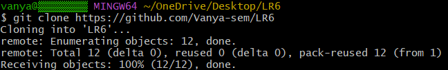
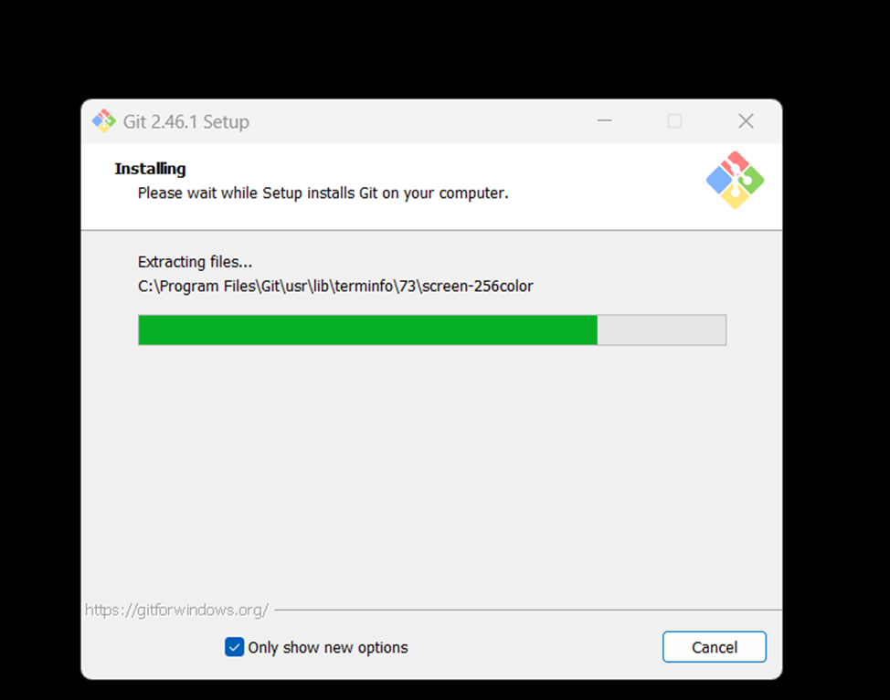
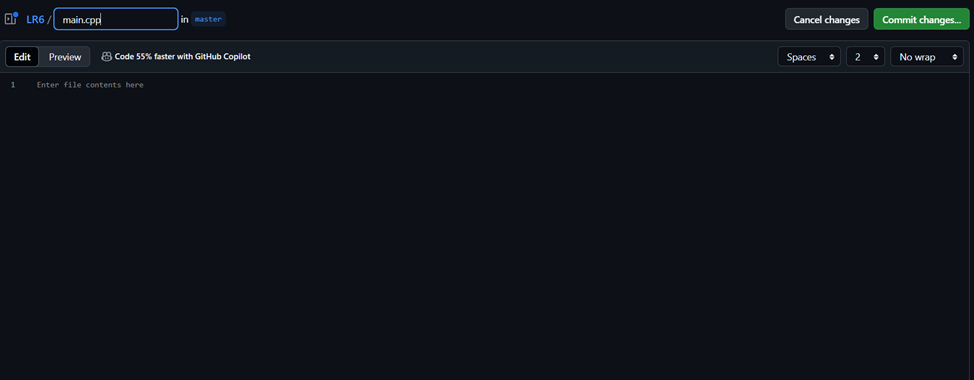
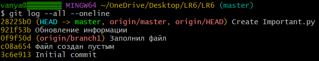
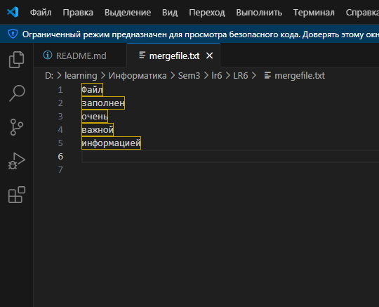
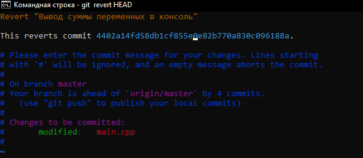

# LR6
Лабораторная работа №6

# Отчет по работе с Git

## 1. Создание форка
*Скриншот с созданием форка*  


## 2. Установка Git
*Скриншот с процессом установки git*  


## 3. Изменение имени пользователя
Команда для изменения имени пользователя:

```bash
$ git config --global user.name "4317 Семенов И. А."
```

## 4. Клонирование репозитория

```bash
$ git clone https://github.com/Vanya-sem/LR6
```

## 5. Добавление нового файла
*Скриншет с добавлением нового файла*


## 6. Добавление изменений в локальный репозиторий

```bash
$ git pull
```

## 7. Получение данных для каждой из веток

```bash
$ git log --all –oneline
```

*Результат работы команды*



## 8. Просмотр последних изменений

```bash
$ git log -1
```


## 9. Решение конфликта и слияние веток

```bash
$ git checkout master
$ git marge branch1
```
Решение конфликта с помощью инструментов VS code путем замены содержимого mergefile.txt в ветке branch1

*Результат работы команды*




## 10. Удаление побочной ветки после слияния

```bash
$ git branch -d branch1
```

## 11. Откат коммита
Посмотреть логи с помощью команды:

```bash
$ git log --all –oneline
```

Откат к предыдущему коммиту:

```bash
$ git reset --hard 06c6aec
```

*Результат работы команды*




## 12. Создание ветки для отчета

```bash
$ git checkout -b report
```

## 13. Получение истории операций в форматированном виде

```bash
$ git log --pretty=format:"%h %ad %an %s" --date=short
```

## 14. История операций
Список истории операций:
+ 80cd415 2024-09-19 4317 Семенов И. А. добавление скриншота
+ f6c2088 2024-09-19 4317 Семенов И. А. Создание отчета
+ ee3778b 2024-09-19 4317 Семенов И. А. создание отчета
+ 5247197 2024-09-19 4317 Семенов И. А. создание отчета
+ f854dfa 2024-09-19 4317 Семенов И. А. создание папки для снимков экрана
+ 06c6aec 2024-09-19 4317 Семенов И. А. создание main функции
+ c76263f 2024-09-19 4317 Семенов И. А. Merge branch 'branch1'
